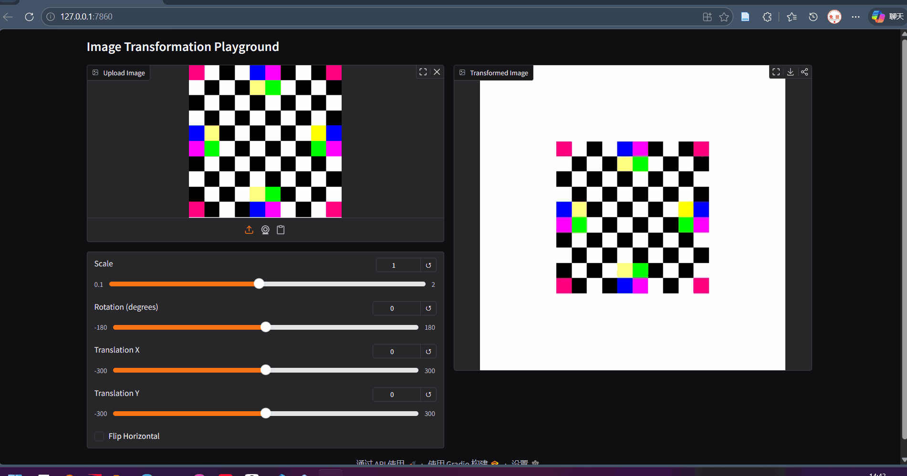

# Assignment 1 - Image Warping

本仓库为高凡(SA25001019) DIP HW1 Image Warping 作业代码仓

## Requirements
Python Version: 3.14

You can initialize the environment with [uv](https://docs.astral.sh/uv/):
```shell
# after cd to this directory
uv sync
uv pip install -r requirements.txt
```

or just install the requirements (if you already have pip):
```shell
pip install -r requirements.txt
```

## Evaluation
To run global transform:
```shell
python ./run_global_transform.py
```

To run point-guided transform:
```shell
python ./run_point_transform.py
```
> There are some images in the data/ folder. You can use them for test.
## Results
### Global Transform
依次操作为：缩放、旋转、平移、翻转


### Point-Guided Transform
在不同选点下Warping的结果
