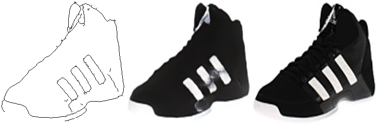
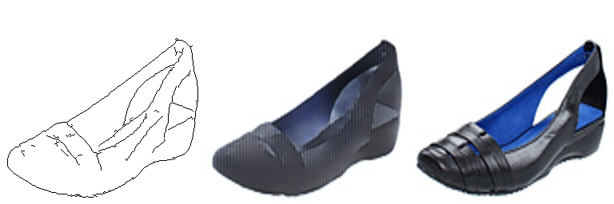
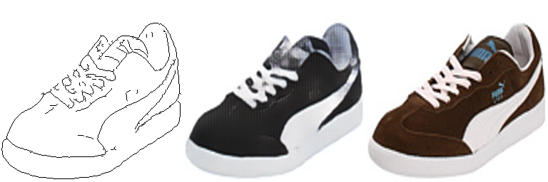
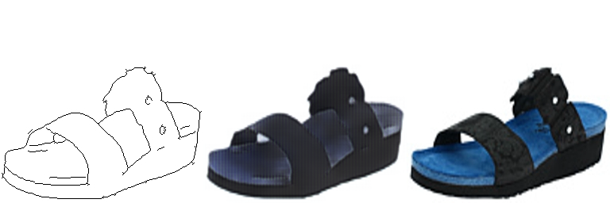
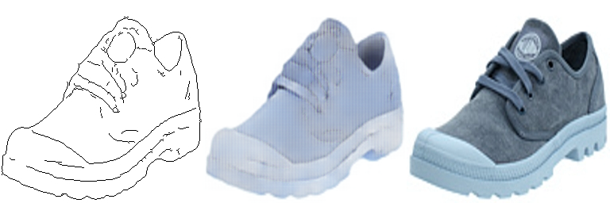

# Assignment 2 - DIP with PyTorch

本仓库为高凡(SA25001019) DIP HW2 DIP with PyTorch 作业代码仓

## Requirements

You can create the environment with the following command (conda is required!):

```bash
conda env create -f environment.yml
```

## Task 1: Poisson Editing with PyTorch

### Evaluation

Run the following command to start the gradio UI:

```bash
python ./run_blending_gradio.py
```

> Images for test are stored in 'data_poisson' folder

### Results


## Task 2：Pix2Pix

### Data Preperation

1. Make sure your current working directory is `Assignments/02_DIPwithPyTorch/Pix2Pix`

2. Download the dataset (run the following command). We use `edges2shoes` dataset for training & validation.
   
   ```bash
   ./download_dataset.sh edges2shoes
   ```

### Training

Run the training script:

```bash
CUDA_VISIBLE_DEVICES=<YOUR_DEVICE_ID> python ./train.py
```

The checkpoints will be stored in `checkpoints` folder. Results on `train` & `valid` sets will be saved in `*_results`

### Evaluation

**Prepare the model** :  You can train the model by yourself or download the pretrained model at [Release HW-2 Model CKPT · SyouSanGin/GF-DIP26-Homework](https://github.com/SyouSanGin/GF-DIP26-Homework/releases/tag/HW-2) and put the file into `checkpoints` folder.

**Inference**： Run the following command to generate results:

```bash
python ./eval.py\
 --test_dir datasets/edges2shoes/val \
 --model_path <Where you store the checkpoint> 
```

Outputs will be saved in "test_results" folder.

### Results

The following results were all generated from the “val” portion of the edges2shoes dataset. For more results, see [HERE](./test_results)

**Average SSIM**: 0.915

From left to right: **edge map**, **generated result**, **ground truth**










