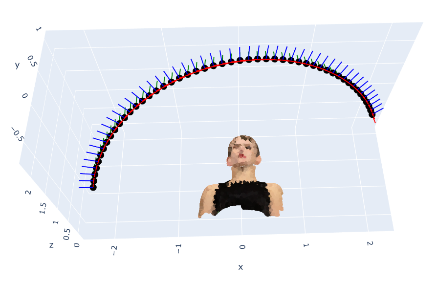
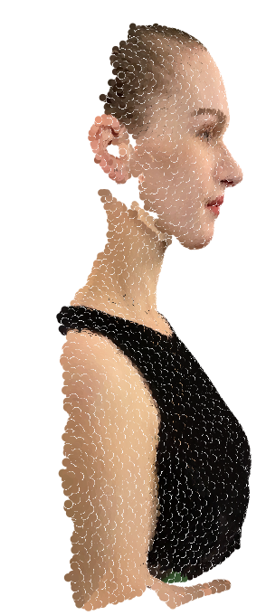
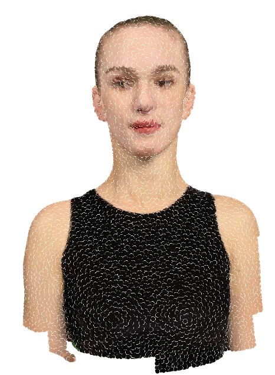
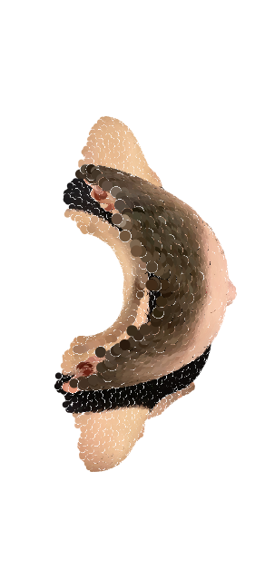
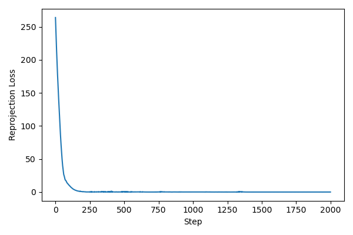
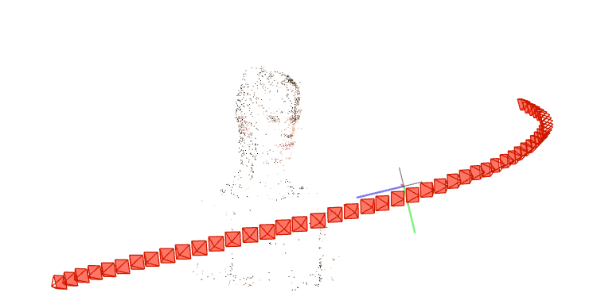
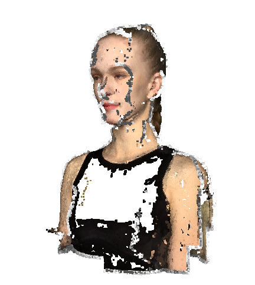

# Assignment 3 - Bundle Adjustment

本仓库为高凡(SA25001019) DIP HW3 Bundle Adjustment 作业代码仓

## Requirements

You can create the environment with the following command (conda is required!):

```bash
conda env create -f environment.yml
```

## Task 1: Bundle Adjustment via PyTorch

### Evaluation

1. Make sure your current working directory is `Assignments/03_BundleAdjustment`.

2. Run the following command:
   
   ```bash
   python ./bundle_adjustment.py --data_dir data --output_dir output
   ```

3. After running, check the `output` directory. The expected structure is:
   
   ```
   output/
   ├── ba_loss.png           # Loss curve
   ├── ba_params.pt          # optimized result ckpt
   ├── ba_scene.html         # visualization of cameras & points
   └── points3d_recon.obj    # pointcloud of the face
   ```

### Results

Results can be found at [GF-DIP26-Homework/Assignments/03_BundleAdjustment/output at main · SyouSanGin/GF-DIP26-Homework](https://github.com/SyouSanGin/GF-DIP26-Homework/tree/main/Assignments/03_BundleAdjustment/output)

**Cameras & Point cloud**





**Loss Curve**



## Task 2: 3D Reconstruction with COLMAP

This task is implemented solely by invoking the external tool COLMAP, and thus only the reconstruction results are presented. The operating environment is Windows 11 with an Intel i5-1135G7 processor, **running on CPU only**. The reconstruction is executed via the COLMAP GUI.

### Results

Sparse Reconstruction Result:



Dense Reconstruction Result:



The sparse reconstruction can be found at [here](./data/sparse)

The dense reconstruction mesh can be found at [here](./data/fused.ply)

Due to the absence of valid features that can be effectively used for matching in the chest region of the human subject across multiple viewing angles, the dense reconstruction result cannot be generated.
