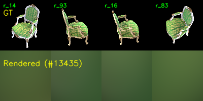
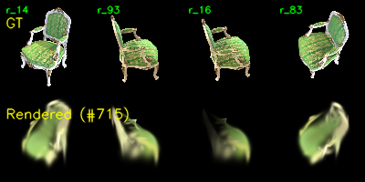
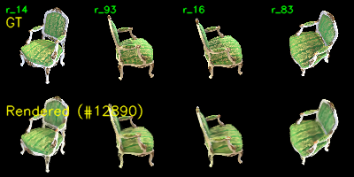
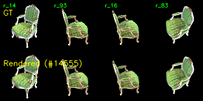
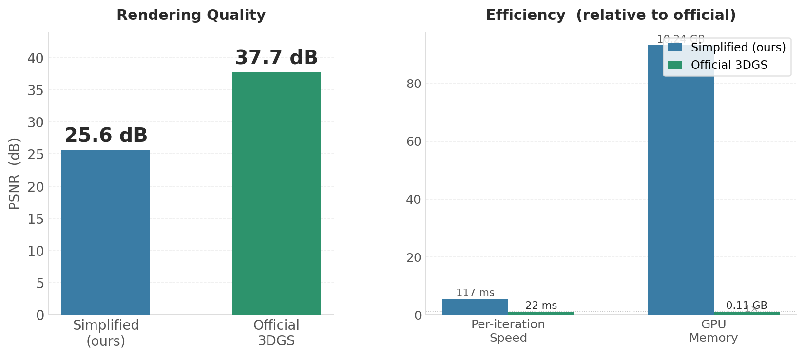

# Assignment 4 - Implement Simplified 3D Gaussian Splatting

本仓库为SA25001019 高凡 DIP HW4 3D Gaussian Splatting 作业代码仓

## Requirements

使用 conda 创建环境：

```bash
conda create -n dip-hw python=3.10
conda activate dip-hw
pip install torch torchvision --index-url https://download.pytorch.org/whl/cu128
pip install opencv-python natsort tqdm numpy
```

> **注意**: PyTorch 2.7.1 无法安装 pytorch3d，本实现已用原生 `torch.cdist` + `torch.topk` 替代 KNN 功能。
>
> 官方 3DGS 对比实验使用同一 `dip-hw` 环境，按照其文档安装相应依赖即可

---

## Task 1: Structure-from-Motion with COLMAP

### Evaluation

1. 确保当前工作目录为 `Assignments/04_3DGS`

2. 运行 SfM 管线：
   ```bash
   python mvs_with_colmap.py --data_dir data/chair
   ```

3. 验证 3D 点投影：
   ```bash
   python debug_mvs_by_projecting_pts.py --data_dir data/chair
   ```

4. 预期输出结构：
   ```
   data/chair/
   ├── sparse/
   │   ├── 0/            # COLMAP 二进制输出
   │   └── 0_text/       # 文本格式（供本作业读取）
   ├── projections/      # 投影验证图像（100 张）
   └── images/           # 原始图像（100 张）
   ```

**COLMAP 兼容性修正**: 我本地的COLMAP为 3.13，该版本的选项名与旧版不同，故按下方所示修改colmap脚本 `mvs_with_colmap.py`：

| 旧选项 | 新选项 |
|--------|--------|
| `--SiftExtraction.use_gpu 0` | `--FeatureExtraction.use_gpu 0` |
| `--SiftMatching.use_gpu 0` | `--FeatureMatching.use_gpu 0` |
| `true`/`false` | `0`/`1` |

### Results

| 指标 | 数值 |
|------|------|
| 输入图像 | 100 张 (800×800) |
| 注册相机数 | 99 |
| 3D 点数量 | 13,435 |
| 相机模型 | PINHOLE |
| 原始焦距 | 960 px |
| 内参 | [[138.89, 0, 50], [0, 138.92, 50], [0, 0, 1]] |

**COLMAP 投影验证**

3D 点重投影到图像平面，点颜色来自 COLMAP 重建的 RGB 值，与原始图像并排对比。


---

## Task 2: Simplified 3D Gaussian Splatting

> 注：为确保能够正确重建，相较于原始的脚本增加了高斯密度控制的部分，不然重建出来的结果总是黑色的一片……

### Evaluation

1. 训练：
   ```bash
   python train.py --colmap_dir data/chair --checkpoint_dir data/chair/checkpoints --num_epochs 100
   ```

2. 轨道视角视频：
   ```bash
   python render_3dgs_mv.py --colmap_dir data/chair --checkpoint data/chair/checkpoints/checkpoint_000080.pt --num_frames 240 --fps 30
   ```

### Results

**训练渲染质量**

AVE PSNR：25.63

**调试图像（GT vs Rendered）**

训练过程中四个 epoch 的对照（上排：GT，下排：Rendered）：






**输出文件**

```
data/chair/checkpoints/
├── checkpoint_000080.pt       # 训练模型（14,555 高斯）
├── debug_images/epoch_*.png   # 100 张调试图像
├── debug_rendering.mp4        # 训练相机路径视频
└── ...
data/chair/render_mv.mp4       # 水平轨道视角视频（240 帧）
```

---

## Task 3: 与官方 3DGS 的对比

本作业同时使用基于官方 3DGS CUDA rasterizer 的实现，在同一 chair 数据集上进行重建，作为对比基线。

### Evaluation

```bash
cd <3DGS-DIR>
python train.py -s ../data/chair -m ../data/chair/output_3dgs --eval -r 4
python render.py -m ../data/chair/output_3dgs
```


### Results

**PSNR 对比**



**完整指标对比**

| 指标 | 简化实现（本作业） | 官方 3DGS |
|------|---------------------|---------|
| PSNR | 25.6 dB | **37.7 dB** |
| L1 Loss | 0.015 | **0.0035** |
| 训练总时间 | ~20 min（10K iter） | ~11 min（30K iter） |
| 每迭代耗时（实测） | 117 ms (8.5 iter/s) | 22 ms (45 iter/s) |
| 训练分辨率 | 100×100 | 200×200 |
| 峰值显存 | 10.24 GB | 0.11 GB |
| 最终高斯数 | 14,555 | 75,872 |
| 颜色模型 | RGB (3D) | SH degree 3 (48D) |


### 差异分析

**1. 渲染质量差异（25.6 vs 37.7 dB，+12.1 dB）**

- CUDA tile-based rasterizer（减少混叠和浮点误差）
- SH 球谐函数（原始3DGS采用视角相关颜色，该实现中仅使用3D RGB） 
- 更精细化的稠密化（76K vs 14K 高斯）

**2. 训练速度与显存差异（117ms vs 22ms/迭代，5.3×；10.24 GB vs 0.11 GB）**

- 该实现：PyTorch 自动微分保留全部 `(N,H,W)` = (13K, 100, 100) 中间张量，峰值显存 10.24 GB
- 官方 3DGS：CUDA kernel 在 on-chip memory 中完成 tile 排序和混合，无需大型中间张量。高分辨率（200×200，4× 像素量）下仍快 5.3 倍，显存仅 0.11 GB（**93× 差距**）

**3. 稠密化效率差异**

官方 3DGS 使用 CUDA KNN（simple-knn）进行邻域查询，触发频率为每 100 iteration（本实现每 200 iteration）